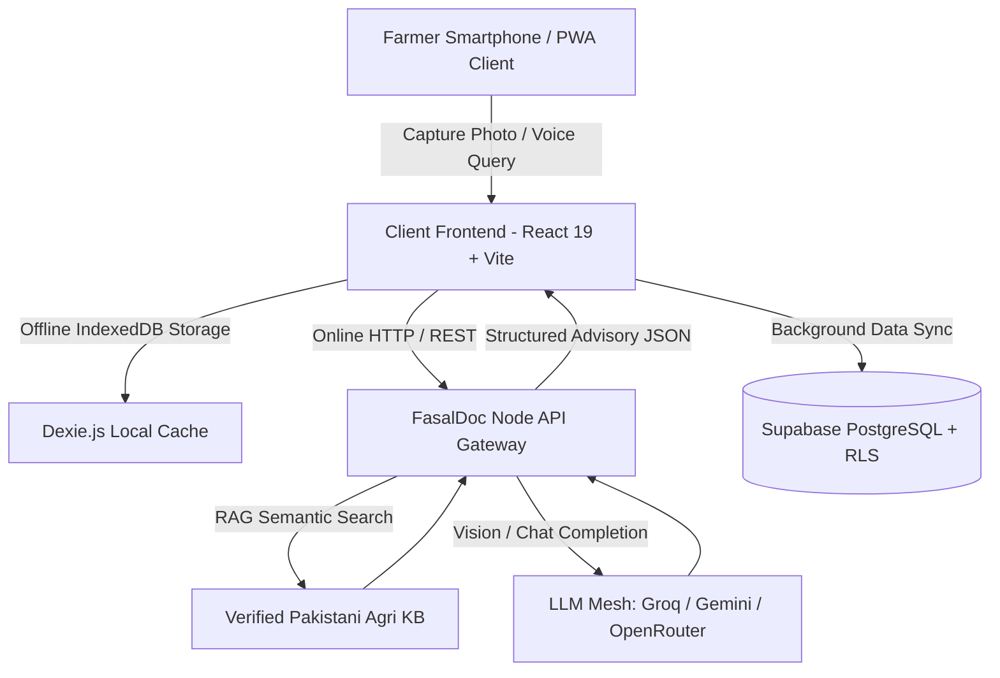

# 🌱 FasalDoc — AI-Powered Crop & Livestock Health Intelligence Engine

[](https://build-nu-nine-56.vercel.app/)
[](https://vitejs.dev/)
[](https://react.dev/)
[](https://nodejs.org/)
[](https://supabase.com/)

[**🌐 Open Live Production App**](https://build-nu-nine-56.vercel.app/)

FasalDoc is an offline-first Progressive Web Application (PWA) designed to provide instant visual disease diagnostics, bilingual voice advisory (Urdu/English), localized RAG guidance, and 14 essential farm management tools for crop and livestock farmers across Pakistan.

---

## 📸 Key Features & Capabilities

### 🩺 1. Multi-Modal Visual Pathology & RAG Engine
- **Visual Pathology Scanner**: Upload or capture photos of crops or livestock to receive sub-second diagnostic reports with confidence scoring.
- **Localized Agri-RAG Knowledge Base**: Integrated with verified Pakistani agricultural extension datasets to recommend specific, accessible chemical and organic treatments.
- **Sub-50ms Offline Fallback**: Generates instant structured remedy advice even with zero internet connectivity.
- **Sub-Second LLM Mesh Routing**: Dynamic failover between **Groq Llama-3.3-70B**, **Gemini 2.0 Flash**, and **OpenRouter** endpoints.

### 🎙️ 2. Bilingual Voice & Audio Advisory
- **Natural Voice Querying**: Speaks and understands Urdu and English voice notes for hands-free field operations.
- **Auto RTL/LTR Layout**: Fully responsive, seamless layout direction switching for native Urdu rendering.

### ⚡ 3. Resilient Offline-First Architecture
- **Dexie.js (IndexedDB) Cache**: Stores scans, remedies, offline diagnostic logs, and chat histories locally on device.
- **Background Cloud Sync**: Automatically enqueues offline mutations and reconciles data with **Supabase PostgreSQL** once connection is restored.
- **1-Tap Guest Mode**: Built-in seeded demo profile (**چوہدری طارق**) for instant evaluation without registration barriers.

### 🛠️ 4. Farmer Utility Hub — 14 Field Tools (`/tools`)
1. **Disease & Pathology Library**: Searchable database of localized crop pests and animal health conditions.
2. **Fertilizer & NPK Dosage Calculator**: Custom per-acre/kanal calculation for DAP, Urea, SOP Potash, and Zinc.
3. **Emergency Helpline Directory**: 1-tap direct phone dialing for local veterinary clinics and agricultural extensions.
4. **Interactive Pitch Deck**: Built-in executive slideshow for pitch competitions and investor demos.
5. **Location-Aware Weather & Risk Index**: Real-time weather data with 5-day disease risk forecasting across Pakistani provinces.
6. **Live Mandi Rates**: Daily commodity price monitoring for markets across Punjab, Sindh, KPK, Balochistan, Gilgit-Baltistan, and AJK.
7. **Government Schemes Directory**: Filterable guide to agricultural subsidies (PM Kisan Card, tube-well solarization, crop insurance).
8. **Tele-Vet & Advisor Booking**: Appointment scheduling with registered veterinary doctors and extension specialists.
9. **Crop Sowing Calendar**: Interactive sowing, irrigation, and harvesting windows by crop and region.
10. **Soil Health Assessment**: Evaluation of pH, organic matter, texture, and salinity with amendment guidance.
11. **Irrigation Planner**: Growth-stage dependent water scheduling.
12. **Yield & Revenue Estimator**: Harvest volume and income projections based on current mandi rates.
13. **Seed Rate Calculator**: Acreage-based seed weight recommendations with spacing guidelines.
14. **Community Outbreak Alerts**: Hyperlocal crowd-sourced pest infestation reporting network.

---

## 🏗️ System Architecture



---

## 📁 Project Structure

```text
fasalDoc-aihackathon-/
├── backend/                    # Node.js + Express API Gateway
│   ├── src/
│   │   ├── server.js           # Express API server & routes (/api/diagnose, /api/chat)
│   │   ├── llm.js              # Multi-provider client (Gemini, Groq, OpenRouter)
│   │   ├── rag.js              # Domain RAG retrieval & knowledge engine
│   │   ├── diagnose.js         # Vision diagnosis processor & schema validation
│   │   └── remedyKeys.js       # Crop & livestock catalogue mapping
│   └── package.json
├── src/                        # React 19 PWA Frontend
│   ├── components/             # Offline banners, UI controls, headers, tool cards
│   ├── context/                # AuthContext (Demo/Supabase) & LanguageContext (Urdu/English)
│   ├── lib/                    # API client, Dexie DB, RAG engine, remedy database
│   └── screens/                # HomeScreen, CaptureScreen, AssistantScreen, ToolsScreen, AuthScreen
├── public/                     # Static assets, Web App Manifest & Service Worker
├── supabase/                   # Database migrations & Row Level Security policies
└── vite.config.ts              # Vite PWA and bundle configuration

```

---

## 💻 Tech Stack

| Layer | Technologies | Purpose |
| --- | --- | --- |
| **Frontend App** | React 19, TypeScript, Vite, TailwindCSS | Mobile-first PWA with Urdu RTL/LTR layout |
| **Local Storage & Offline** | Dexie.js (IndexedDB), Service Workers, Workbox | 100% offline data durability and auto-sync queue |
| **Backend API** | Node.js, Express.js (ESM), REST | High-throughput AI proxy, rate-limiting, and RAG orchestrator |
| **AI / ML & Vision** | Gemini 2.0 Flash, Groq Llama-3.3-70B, Vision Models | Sub-second visual pathology diagnosis and natural language reasoning |
| **Knowledge Engine** | Custom Agricultural RAG Engine | Localized chemical/organic treatments for Pakistani farming ecosystems |
| **Database & Auth** | Supabase (PostgreSQL, Row Level Security, Auth) | Secure user accounts, history tracking, and farm profile management |

---

## ⚡ Quick Start Guide

### Prerequisites

* **Node.js**: `>= 18.0.0`
* **npm** or **pnpm**

### 1. Clone & Setup Backend

```bash
cd backend
npm install
cp .env.example .env

```

Add your free API keys in `backend/.env`:

```env
PORT=8000
GROQ_API_KEY=gsk_your_groq_api_key_here
GEMINI_API_KEY=AIzaSy_your_gemini_key_here

```

Start the backend API server:

```bash
npm start
# 🚀 Backend listening on http://localhost:8000

```

### 2. Setup & Run Frontend

In the root directory:

```bash
npm install
npm run dev
# 🌐 Local App accessible at http://localhost:5173

```

> 💡 **Fast Demo Tip**: On the login screen, click **"Continue as Demo Farmer (چوہدری طارق)"** to explore all AI diagnosis, RAG chatbot, and tools features instantly with pre-seeded data.

---

## 🔒 Security & Data Privacy

* **Zero Client-Side API Keys**: All LLM and AI keys are securely held on the Node.js backend proxy.
* **Row-Level Security (RLS)**: User scans, diagnoses, and personal farm data in Supabase are isolated strictly per authenticated user ID.
* **Client-Side Compression**: Photos are downscaled on device before transmission to protect mobile data bandwidth and reduce latency.

---

## 📈 Startup Roadmap

* [x] **Phase 1 (MVP Launch)**: Dual Crop & Livestock Diagnosis + Offline RAG Chatbot + PWA.
* [ ] **Phase 2 (IoT & Weather Integration)**: Hyperlocal weather alerts, mandi (market) rate index, and soil sensor connectivity.
* [ ] **Phase 3 (B2B Marketplace)**: Direct Agri-input ordering with verified local fertilizer & pesticide distributors.
* [ ] **Phase 4 (Government & NGO Tele-Agri)**: Tele-veterinary consultation connecting remote farmers with certified doctors.

---

## 👥 Authors & Acknowledgements

* **MZunurain Tahir** — *Founder & Lead Architect* ([GitHub Profile](https://github.com/MZunurainTahir))
* Developed for **HATCH / NSTP** Innovation Program.
