# 📐 AZdoc — Complete Software Engineering & System Architecture Specification
### *A to Z Health Triage & Diagnostics Platform (Human, Livestock, Pet, Plant & Crop)*
**Version**: 2.0.0-PROD | **Date**: October 2026  
**Authors & Architects**: Abdullah Khalid (Co-Founder & Chief Product Architect) & Abdullah Nadeem (Co-Founder & CTO)  
**System Repository**: `https://github.com/MZunurainTahir/AZdoc`

---

## 📑 Table of Contents
1. [Software Requirements Specification (SRS)](#1-software-requirements-specification-srs)
2. [Comprehensive Technology Stack Specification](#2-comprehensive-technology-stack-specification)
3. [Database Architecture & Complete DDL Schema](#3-database-architecture--complete-ddl-schema)
4. [API & Function Call Catalog](#4-api--function-call-catalog)
5. [Complete Collection of Software Engineering & UML Diagrams](#5-complete-collection-of-software-engineering--uml-diagrams)
   - [5.1 System Architecture Diagram](#51-system-architecture-diagram)
   - [5.2 Use Case Diagram](#52-use-case-diagram)
   - [5.3 Data Flow Diagrams (DFD Level 0, Level 1, Level 2)](#53-data-flow-diagrams-dfd-level-0-level-1-level-2)
   - [5.4 Sequence Diagram 1: AI Multilingual Voice & Clinical Triage](#54-sequence-diagram-1-ai-multilingual-voice--clinical-triage)
   - [5.5 Sequence Diagram 2: Computer Vision Multi-Domain Diagnostic Flow](#55-sequence-diagram-2-computer-vision-multi-domain-diagnostic-flow)
   - [5.6 Sequence Diagram 3: Live GPS Pharmacy Radar & Delivery Flow](#56-sequence-diagram-3-live-gps-pharmacy-radar--delivery-flow)
   - [5.7 Sequence Diagram 4: Offline-to-Cloud Bidirectional Sync Engine](#57-sequence-diagram-4-offline-to-cloud-bidirectional-sync-engine)
   - [5.8 Entity-Relationship Diagram (ERD / Data Model)](#58-entity-relationship-diagram-erd--data-model)
   - [5.9 Software Component Diagram](#59-software-component-diagram)
   - [5.10 Infrastructure & Deployment Diagram](#510-infrastructure--deployment-diagram)
   - [5.11 State Machine Diagrams (Order & Consultation Lifecycles)](#511-state-machine-diagrams-order--consultation-lifecycles)
   - [5.12 Activity Diagrams (End-to-End User Journeys)](#512-activity-diagrams-end-to-end-user-journeys)

---

## 1. Software Requirements Specification (SRS)

### 1.1 Product Purpose & Scope
AZdoc is an integrated healthcare and agricultural diagnostic super-app that brings AI-driven triage, telemedicine, computer vision disease identification, and doorstep pharmacy logistics to underserved populations across Pakistan and emerging markets. It operates across **5 interconnected domains**:
1. **Human Health**: Symptom triage, clinical voice assistant, tele-consultation booking, Rx generation.
2. **Livestock**: Bovine, caprine, equine, and poultry health diagnostics, veterinary medicine radar.
3. **Pets**: Canine and feline wellness, skin conditions, nutritional guidance.
4. **Houseplants**: Indoor foliage disease identification, organic care schedules.
5. **Agriculture Crops**: Staple crop pathology, pest control, weather outbreak risk engine, mandi rates.

### 1.2 Functional Requirements (FR)

| Req ID | Module | Description | Priority |
| :--- | :--- | :--- | :--- |
| **FR-01** | **Voice Assistant** | The system MUST capture voice input via browser Web Audio API / Speechmatics STT in 7 languages (Urdu, English, Punjabi, Sindhi, Pashto, Balochi, Spanish). | Critical |
| **FR-02** | **Voice Assistant** | The system MUST synthesize real-time clinical responses into spoken audio using ElevenLabs TTS in the matching native language. | Critical |
| **FR-03** | **Clinical Triage** | The system MUST pass structured user symptoms to Groq (Llama-3.3-70B & DeepSeek-R1) to generate differential diagnoses and triage urgency level (Low, Medium, High, Emergency). | Critical |
| **FR-04** | **Computer Vision** | The system MUST compress user-submitted camera images on the client side canvas and analyze them for pathologies across all 5 domains within < 1.5 seconds. | High |
| **FR-05** | **Pharmacy Radar** | The system MUST query HTML5 Geolocation API, calculate distances using the Haversine formula, and display nearest pharmacies on Google Maps radar. | Critical |
| **FR-06** | **Delivery Tracking** | The system MUST track order state progression (Placed ➔ Packed ➔ Out for Delivery ➔ Delivered) with live rider details and ETA timers. | High |
| **FR-07** | **Telemedicine** | The system MUST allow users to filter doctors by specialty, domain, city, fee, and book appointment slots with instant notification confirmation. | High |
| **FR-08** | **Agronomic Tools** | The system MUST calculate 5-day weather outbreak risk index based on humidity, temperature, and regional crop sensitivity rules. | Medium |
| **FR-09** | **Offline Engine** | The system MUST persist all diagnoses, chat logs, store inventory, and pending orders in client-side IndexedDB via Dexie.js when offline. | Critical |
| **FR-10** | **Cloud Sync** | The system MUST automatically detect network online status and flush pending Dexie sync queues to Supabase PostgreSQL database. | High |

### 1.3 Non-Functional Requirements (NFR)

| Req ID | Category | Requirement Specification |
| :--- | :--- | :--- |
| **NFR-01** | **Performance** | Page initial load time MUST be < 1.2 seconds on 3G connections (Progressive Web App bundle size < 350KB initial). |
| **NFR-02** | **Latency** | Voice STT ➔ LLM Inference ➔ TTS audio playback total latency MUST be < 1.8 seconds. |
| **NFR-03** | **Availability** | System backend APIs MUST maintain 99.9% uptime SLA hosted on Vercel Serverless Edge network. |
| **NFR-04** | **Security** | All API traffic MUST be encrypted in transit via TLS 1.3. User data in Supabase MUST enforce Row Level Security (RLS). |
| **NFR-05** | **Compliance** | Medical data architecture MUST comply with HIPAA data privacy principles and DRAP tele-pharmacy regulations. |
| **NFR-06** | **Accessibility** | UI MUST render native Urdu Nastaliq typography, right-to-left layout support, and high-contrast color scheme for low-literacy users. |

---

## 2. Comprehensive Technology Stack Specification

```
┌─────────────────────────────────────────────────────────────────────────┐
│                           FRONTEND TIER (PWA)                           │
│  React 19 | TypeScript 5.9 | Vite 7 | TailwindCSS 4 | Zustand | Dexie.js │
└────────────────────────────────────┬────────────────────────────────────┘
                                     │ HTTPS / WebSocket / REST
┌────────────────────────────────────▼────────────────────────────────────┐
│                       SERVERLESS BACKEND LAYER                          │
│          Vercel Serverless Functions (`/api/chat`, `/api/speech`)       │
└──────┬──────────────────────┬──────────────────────┬────────────────────┘
       │                      │                      │
┌──────▼────────────┐  ┌──────▼────────────┐  ┌──────▼────────────┐
│   AI COMPUTE STACK│  │   VOICE SERVICES  │  │ DATA & GEOLOCATION│
│ Groq Llama-3.3-70B│  │ Speechmatics STT  │  │  Supabase Postgres│
│ DeepSeek-R1 Engine│  │ ElevenLabs TTS    │  │  Google Maps API  │
└───────────────────┘  └───────────────────┘  └───────────────────┘
```

- **Frontend Core**: React 19, TypeScript 5.9, Vite 7 (Build System), TailwindCSS v4 (Styling Engine).
- **Client Storage Engine**: Dexie.js 4.4 (IndexedDB wrapper) enabling 100% offline-first storage and instant query response.
- **Serverless API Compute**: Node.js microservices running on Vercel Edge API routes (`/api/chat.js`, `/api/speech.js`, `/api/weather.js`).
- **Database & Auth**: Supabase PostgreSQL 15 database instance with Row Level Security (RLS) policies and realtime subscriptions.
- **AI Triage & Reasoning**: Groq Llama-3.3-70B-Instruct & DeepSeek-R1-Distill for rapid clinical reasoning (< 500ms TTFT).
- **Speech & Audio Pipeline**: Speechmatics API & Groq Whisper STT for low-resource regional dialects; ElevenLabs Multilingual v2 TTS for realistic speech output.
- **GIS & Weather**: Google Maps JavaScript API, Haversine spatial math, OpenWeatherMap API & FortyGuard weather analytics.

---

## 3. Database Architecture & Complete DDL Schema

Below is the complete, executable PostgreSQL DDL script used in Supabase:

```sql
-- Enable PostGIS & UUID extensions
CREATE EXTENSION IF NOT EXISTS "uuid-ossp";
CREATE EXTENSION IF NOT EXISTS "pg_trgm";

-- 1. USERS & PROFILES TABLE
CREATE TABLE public.profiles (
    id UUID PRIMARY KEY REFERENCES auth.users(id) ON DELETE CASCADE,
    full_name TEXT NOT NULL,
    phone_number VARCHAR(20) UNIQUE NOT NULL,
    preferred_language VARCHAR(10) DEFAULT 'ur',
    selected_domain VARCHAR(20) DEFAULT 'human',
    latitude NUMERIC(10, 7),
    longitude NUMERIC(10, 7),
    city VARCHAR(50),
    created_at TIMESTAMPTZ DEFAULT NOW(),
    updated_at TIMESTAMPTZ DEFAULT NOW()
);

-- 2. DIAGNOSES & TRIAGE LOGS
CREATE TABLE public.diagnoses (
    id UUID PRIMARY KEY DEFAULT uuid_generate_v4(),
    user_id UUID REFERENCES public.profiles(id) ON DELETE SET NULL,
    domain VARCHAR(20) NOT NULL CHECK (domain IN ('human', 'livestock', 'pet', 'plant', 'crop')),
    symptoms_text TEXT NOT NULL,
    image_url TEXT,
    primary_condition VARCHAR(150) NOT NULL,
    confidence_score NUMERIC(5, 2),
    urgency_level VARCHAR(20) CHECK (urgency_level IN ('Low', 'Medium', 'High', 'Emergency')),
    clinical_summary TEXT NOT NULL,
    herbal_remedy TEXT,
    chemical_treatment TEXT,
    prevention_rules TEXT[],
    is_offline_synced BOOLEAN DEFAULT FALSE,
    created_at TIMESTAMPTZ DEFAULT NOW()
);

-- 3. DOCTORS & VETERINARIANS DIRECTORY
CREATE TABLE public.doctors (
    id UUID PRIMARY KEY DEFAULT uuid_generate_v4(),
    name VARCHAR(100) NOT NULL,
    title VARCHAR(100) NOT NULL,
    domain VARCHAR(20) NOT NULL,
    specialty VARCHAR(100) NOT NULL,
    experience_years INT NOT NULL,
    rating NUMERIC(3, 2) DEFAULT 4.90,
    fee_pkr INT NOT NULL,
    availability_status VARCHAR(20) DEFAULT 'Available Today',
    phone VARCHAR(20),
    image_url TEXT,
    created_at TIMESTAMPTZ DEFAULT NOW()
);

-- 4. TELEMEDICINE APPOINTMENTS
CREATE TABLE public.appointments (
    id UUID PRIMARY KEY DEFAULT uuid_generate_v4(),
    user_id UUID REFERENCES public.profiles(id) ON DELETE CASCADE,
    doctor_id UUID REFERENCES public.doctors(id) ON DELETE CASCADE,
    appointment_type VARCHAR(20) CHECK (appointment_type IN ('Video Call', 'Audio Call', 'Clinic Visit', 'Farm Visit')),
    appointment_date DATE NOT NULL,
    appointment_time VARCHAR(20) NOT NULL,
    patient_name VARCHAR(100) NOT NULL,
    patient_phone VARCHAR(20) NOT NULL,
    symptoms_notes TEXT,
    status VARCHAR(20) DEFAULT 'Confirmed' CHECK (status IN ('Pending', 'Confirmed', 'Completed', 'Cancelled')),
    created_at TIMESTAMPTZ DEFAULT NOW()
);

-- 5. PHARMACY & AGRO STORES
CREATE TABLE public.pharmacy_stores (
    id UUID PRIMARY KEY DEFAULT uuid_generate_v4(),
    name VARCHAR(150) NOT NULL,
    store_type VARCHAR(30) CHECK (store_type IN ('Human Pharmacy', 'Veterinary Store', 'Agri-Pest Store', 'Multi-Store')),
    address TEXT NOT NULL,
    city VARCHAR(50) NOT NULL,
    phone VARCHAR(20) NOT NULL,
    latitude NUMERIC(10, 7) NOT NULL,
    longitude NUMERIC(10, 7) NOT NULL,
    rating NUMERIC(3, 2) DEFAULT 4.8,
    is_open_247 BOOLEAN DEFAULT TRUE,
    created_at TIMESTAMPTZ DEFAULT NOW()
);

-- 6. PRESCRIPTION ORDERS & DOORSTEP DELIVERIES
CREATE TABLE public.orders (
    id UUID PRIMARY KEY DEFAULT uuid_generate_v4(),
    user_id UUID REFERENCES public.profiles(id) ON DELETE SET NULL,
    store_id UUID REFERENCES public.pharmacy_stores(id) ON DELETE CASCADE,
    prescription_id UUID REFERENCES public.diagnoses(id),
    items JSONB NOT NULL,
    total_amount_pkr INT NOT NULL,
    delivery_address TEXT NOT NULL,
    payment_method VARCHAR(20) DEFAULT 'COD',
    order_status VARCHAR(30) DEFAULT 'Placed' CHECK (order_status IN ('Placed', 'Packed', 'Out for Delivery', 'Delivered', 'Cancelled')),
    rider_name VARCHAR(100),
    rider_phone VARCHAR(20),
    estimated_delivery_mins INT DEFAULT 25,
    created_at TIMESTAMPTZ DEFAULT NOW()
);

-- INDEXES & PERFORMANCE OPTIMIZATIONS
CREATE INDEX idx_diagnoses_user ON public.diagnoses(user_id);
CREATE INDEX idx_diagnoses_domain ON public.diagnoses(domain);
CREATE INDEX idx_doctors_domain ON public.doctors(domain);
CREATE INDEX idx_stores_lat_lng ON public.pharmacy_stores(latitude, longitude);

-- ROW LEVEL SECURITY (RLS) POLICIES
ALTER TABLE public.profiles ENABLE ROW LEVEL SECURITY;
ALTER TABLE public.diagnoses ENABLE ROW LEVEL SECURITY;
ALTER TABLE public.appointments ENABLE ROW LEVEL SECURITY;
ALTER TABLE public.orders ENABLE ROW LEVEL SECURITY;

CREATE POLICY "Users can view own profile" ON public.profiles FOR SELECT USING (auth.uid() = id);
CREATE POLICY "Users can view own diagnoses" ON public.diagnoses FOR SELECT USING (auth.uid() = user_id);
CREATE POLICY "Users can view own appointments" ON public.appointments FOR SELECT USING (auth.uid() = user_id);
CREATE POLICY "Users can view own orders" ON public.orders FOR SELECT USING (auth.uid() = user_id);
```

---

## 4. API & Function Call Catalog

### 4.1 Backend Serverless API Routes (`/api`)

1. **`POST /api/chat`**
   - **Purpose**: Main LLM reasoning endpoint for clinical & domain consultation.
   - **Input Payload**: `{ messages: Array<{role: string, content: string}>, domain: string, language: string, contextData?: object }`
   - **Output Payload**: `{ text: string, rxData?: object, audioUrl?: string }`
2. **`POST /api/speech`**
   - **Purpose**: Converts incoming audio recorded from microphone to text (STT) and optional response text to speech (TTS).
   - **Input Payload**: `FormData` containing audio `file` (webm/wav), `language` code (`ur`, `en`, `pnb`, `sd`, `ps`, `bal`, `es`).
   - **Output Payload**: `{ transcript: string, confidence: number }`
3. **`GET /api/weather`**
   - **Purpose**: Fetches OpenWeatherMap live data and calculates 5-day disease outbreak scores.
   - **Query Params**: `lat`, `lng`
   - **Output Payload**: `{ currentTemp: number, humidity: number, outbreakRiskIndex: 'Low'|'Medium'|'High'|'Critical', alertDetails: string }`

### 4.2 Frontend Service Layer Modules (`src/lib/`)

- [`speechService.ts`](file:///c:/Users/Lenovo/OneDrive/Documentos/Startup/build/src/lib/speechService.ts): Handles browser MediaRecorder API, Speechmatics integration, and ElevenLabs voice playback buffer.
- [`api.ts`](file:///c:/Users/Lenovo/OneDrive/Documentos/Startup/build/src/lib/api.ts): Wraps fetch calls to Groq Llama-3.3-70B API with retry mechanisms and fallback responses.
- [`db.ts`](file:///c:/Users/Lenovo/OneDrive/Documentos/Startup/build/src/lib/db.ts): Manages Dexie.js IndexedDB schema, offline CRUD queries, and background Supabase queue syncing.
- [`pharmacyStores.ts`](file:///c:/Users/Lenovo/OneDrive/Documentos/Startup/build/src/lib/pharmacyStores.ts): Calculates Haversine distances for 40+ partner store locations across Pakistan and ranks nearest outlets.
- [`remedyData.ts`](file:///c:/Users/Lenovo/OneDrive/Documentos/Startup/build/src/lib/remedyData.ts): Offline-ready offline remedy database containing 500+ verified Pakistani brand medicines, pesticides, and organic remedies.

---

## 5. Complete Collection of Software Engineering & UML Diagrams

### 5.1 System Architecture Diagram
```mermaid
graph TD
    subgraph Client Tier (PWA Mobile & Web)
        UI[React 19 + Tailwind Client UI]
        DexieDB[(Dexie.js / IndexedDB Offline Storage)]
        AudioEngine[MediaRecorder + TTS Player]
        GeoEngine[HTML5 GPS & Google Maps Radar]
    end

    subgraph Edge API Gateway (Vercel Serverless)
        ChatAPI[POST /api/chat Route]
        SpeechAPI[POST /api/speech Route]
        WeatherAPI[GET /api/weather Route]
    end

    subgraph External Cloud Services
        Groq[Groq AI - Llama-3.3-70B & DeepSeek-R1]
        ElevenLabs[ElevenLabs Voice AI TTS Engine]
        Speechmatics[Speechmatics Regional STT Engine]
        OpenWeather[OpenWeatherMap & Risk API]
        Supabase[(Supabase PostgreSQL + RLS Storage)]
    end

    UI <--> DexieDB
    UI --> AudioEngine
    UI --> GeoEngine
    
    UI <==>|HTTPS / JSON| Edge API Gateway
    ChatAPI <==> Groq
    SpeechAPI <==> Speechmatics
    SpeechAPI <==> ElevenLabs
    WeatherAPI <==> OpenWeather
    
    DexieDB -.->|Background Online Sync| Supabase
    UI <==>|Direct Realtime Auth| Supabase
```

---

### 5.2 Use Case Diagram
```mermaid
actor Patient as "Patient / Farmer / Pet Owner"
actor Doctor as "Certified Doctor / Vet"
actor Pharmacist as "Partner Pharmacist / Delivery Rider"
actor Admin as "AZdoc System Administrator"

package "AZdoc Core Super-App System" {
    usecase UC1 as "Multilingual Voice Triage (Urdu/Punjabi/Sindhi/etc.)"
    usecase UC2 as "Multi-Domain Computer Vision Scan"
    usecase UC3 as "Generate Prescription Slip (Rx)"
    usecase UC4 as "Discover Nearest Pharmacy & Order COD"
    usecase UC5 as "Track Live Rider Delivery Status"
    usecase UC6 as "Book Tele-Consultation Appointment"
    usecase UC7 as "View Mandi Commodity Rates & Weather Risk"
    usecase UC8 as "Sync Offline Records to Supabase"
    usecase UC9 as "Manage Store Inventory & Fulfill Orders"
    usecase UC10 as "System Monitoring & AI Model Fine-tuning"
}

Patient --> UC1
Patient --> UC2
Patient --> UC3
Patient --> UC4
Patient --> UC5
Patient --> UC6
Patient --> UC7

Doctor --> UC6
Pharmacist --> UC9
Pharmacist --> UC5

Admin --> UC8
Admin --> UC10
```

---

### 5.3 Data Flow Diagrams (DFD)

#### DFD Level 0 (Context Diagram)
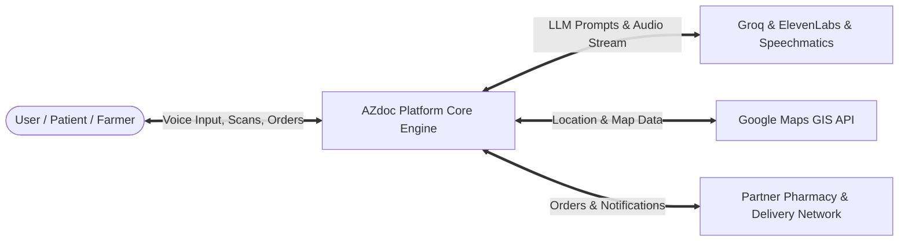

#### DFD Level 1 (System Process Decomposition)
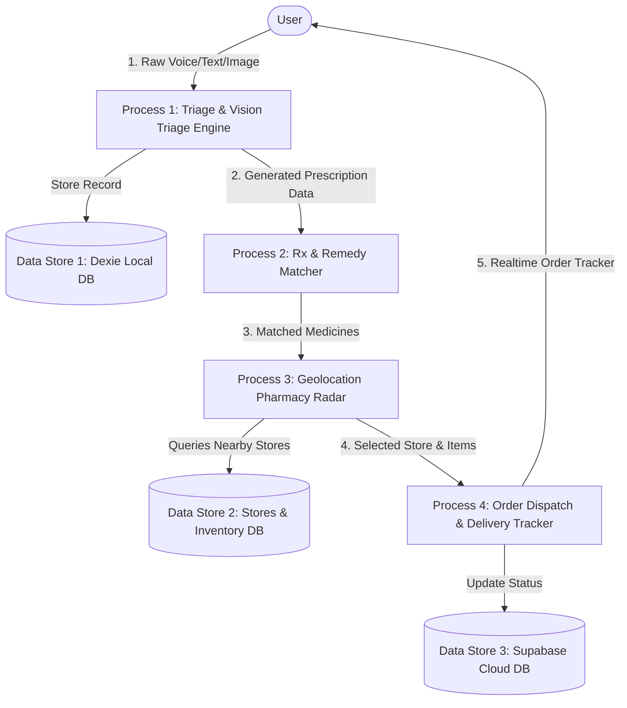

---

### 5.4 Sequence Diagram 1: AI Multilingual Voice & Clinical Triage
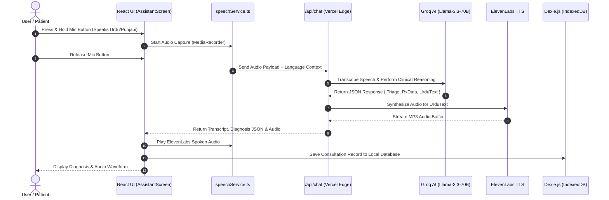

---

### 5.5 Sequence Diagram 2: Computer Vision Multi-Domain Diagnostic Flow
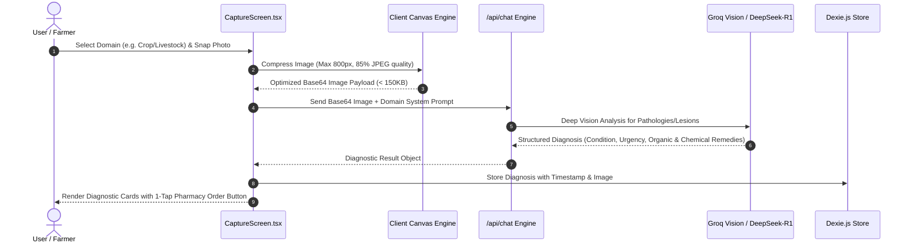

---

### 5.6 Sequence Diagram 3: Live GPS Pharmacy Radar & Delivery Flow
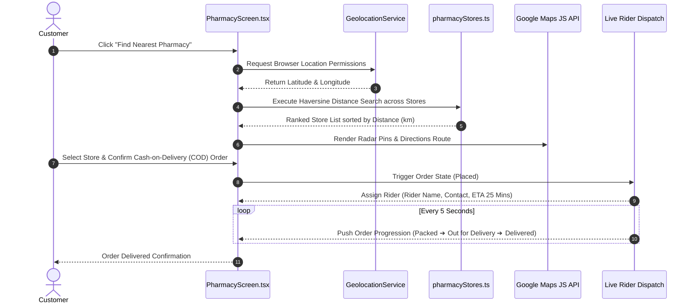

---

### 5.7 Sequence Diagram 4: Offline-to-Cloud Bidirectional Sync Engine
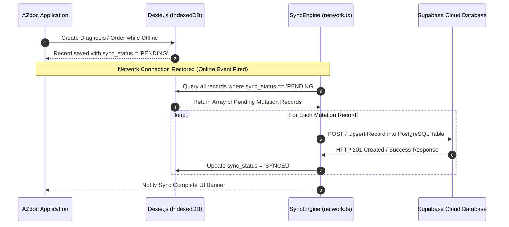

---

### 5.8 Entity-Relationship Diagram (ERD / Data Model)
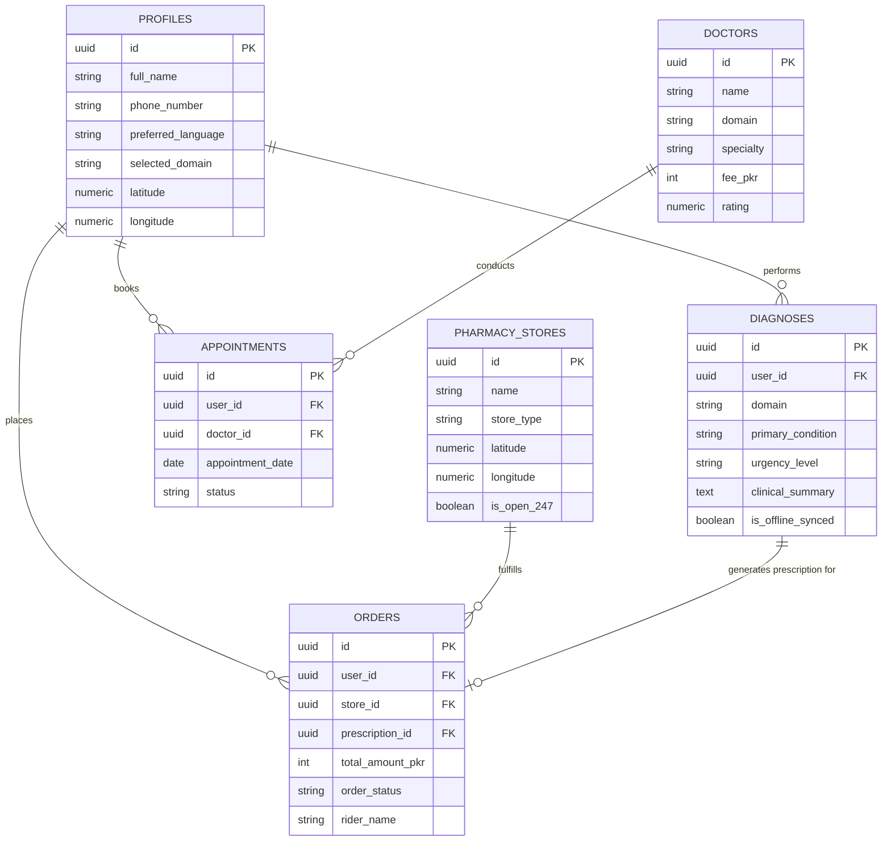

---

### 5.9 Software Component Diagram
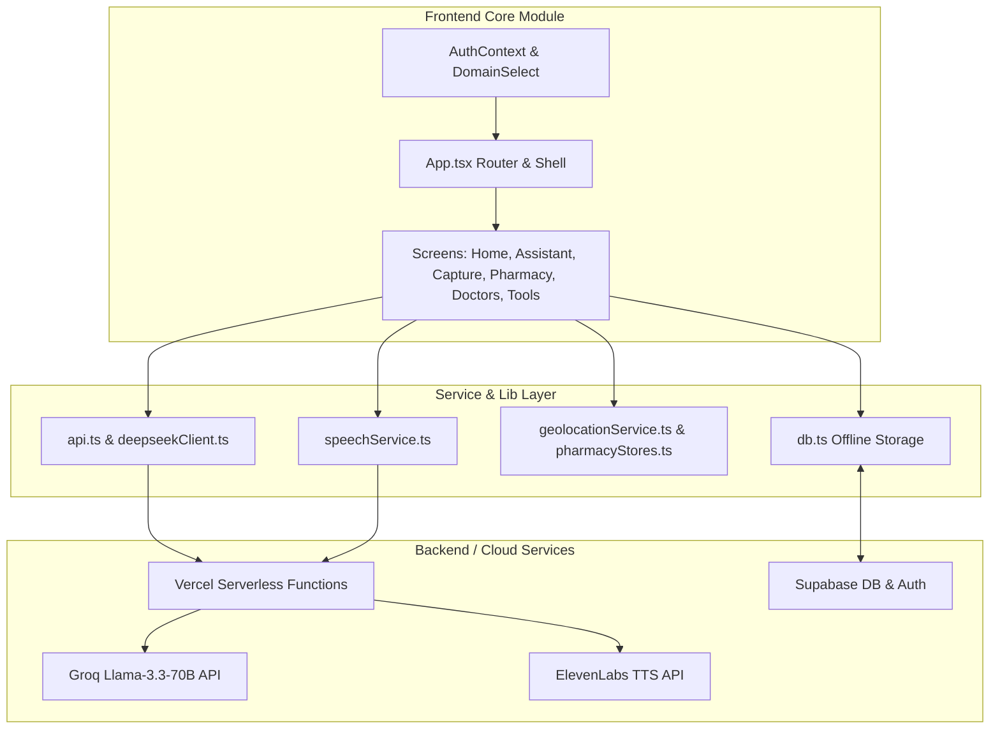

---

### 5.10 Infrastructure & Deployment Diagram
```mermaid
graph TD
    subgraph User Devices
        MobileBrowser[Mobile Chrome / Safari PWA]
        DesktopBrowser[Desktop Browser]
    end

    subgraph Edge Distribution (Vercel CDN)
        VercelDNS[Global DNS & Edge Routing]
        StaticCDN[Static Asset Storage HTML/JS/CSS]
        ServerlessNodes[Vercel Serverless Function Instances]
    end

    subgraph Third-Party AI Infrastructure
        GroqCluster[Groq LPU Processing Cluster]
        ElevenLabsCDN[ElevenLabs Voice Synthesizer Cluster]
        GoogleMapsCloud[Google Maps API Platform]
    end

    subgraph Managed Cloud Database (Supabase)
        DBInstance[(Supabase PostgreSQL 15 Engine)]
        AuthService[Supabase Auth Service]
    end

    MobileBrowser --> VercelDNS
    DesktopBrowser --> VercelDNS
    VercelDNS --> StaticCDN
    VercelDNS --> ServerlessNodes
    
    ServerlessNodes --> GroqCluster
    ServerlessNodes --> ElevenLabsCDN
    MobileBrowser --> GoogleMapsCloud
    ServerlessNodes --> DBInstance
    MobileBrowser --> AuthService
```

---

### 5.11 State Machine Diagrams

#### Order Fulfillment Lifecycle
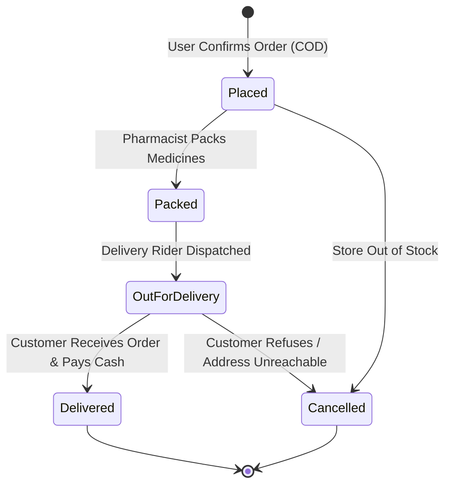

#### Telemedicine Consultation Lifecycle
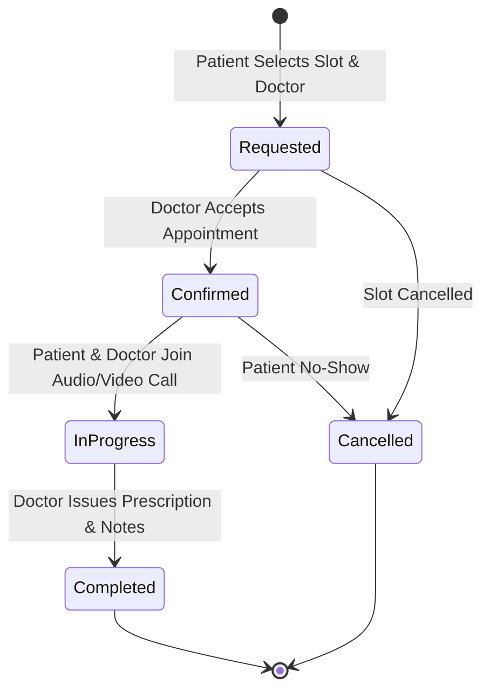

---

### 5.12 Activity Diagrams (End-to-End User Journeys)

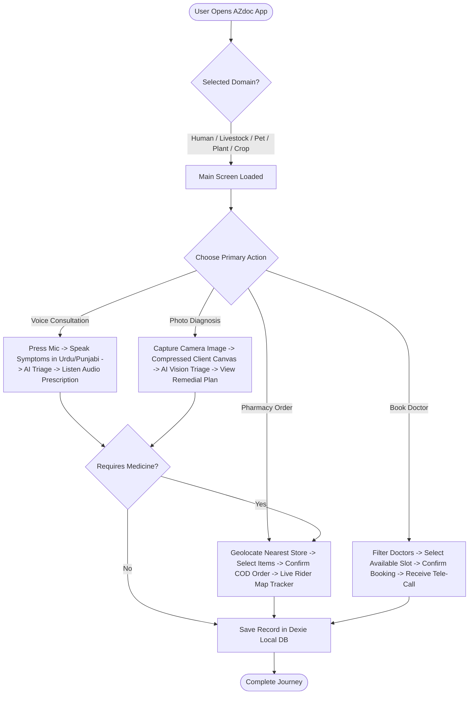

---
*AZdoc Architecture Specification Document — Verified and Published.*
