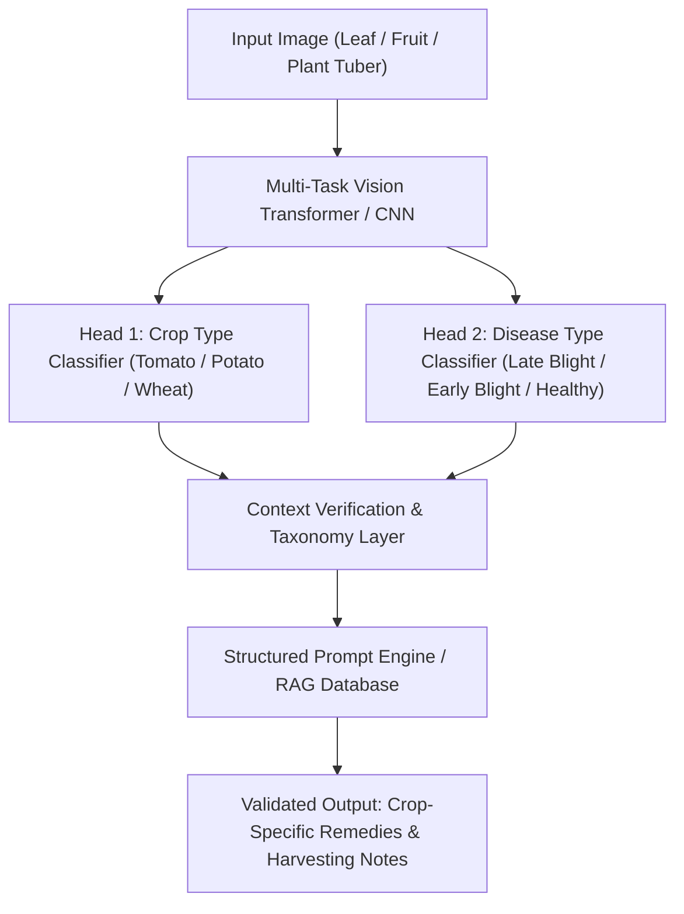

# 🌿 Multi-Modal Agricultural AI Architecture (CV + NLP/LLM)
### *Context-Aware Plant Pathology & Cross-Crop Validation Framework*

---

## 📑 1. Dataset Strategy & Taxonomy Sourcing

To prevent cross-crop hallucinations (e.g. applying potato tuber harvest advice to tomatoes infected with *Phytophthora infestans*), the computer vision and LLM pipeline relies on strict taxonomy categorization: **`[Crop_Type]` + `[Disease_Name]`**.

### 📦 Recommended Datasets
1. **PlantVillage Dataset**:
   - 54,303 images covering 14 crop species and 26 diseases.
   - Key Classes: `Tomato___Late_blight`, `Potato___Late_Blight`, `Tomato___Early_blight`, `Potato___Early_blight`.
2. **Kaggle Potato & Tomato Disease Datasets**:
   - High-resolution field photos under varied lighting and soil background conditions.
3. **PlantDoc Dataset**:
   - 2,598 images with 13 plant species and 30 classes for in-field object detection and foliage segmentation.

### 🏷️ Strict Labeling Schema
```yaml
Classes:
  - crop: Tomato
    disease: Late Blight
    pathogen: Phytophthora infestans
    label_id: tomato_late_blight
  - crop: Potato
    disease: Late Blight
    pathogen: Phytophthora infestans
    label_id: potato_late_blight
  - crop: Tomato
    disease: Early Blight
    pathogen: Alternaria solani
    label_id: tomato_early_blight
  - crop: Potato
    disease: Early Blight
    pathogen: Alternaria solani
    label_id: potato_early_blight
```

---

## 🧠 2. Deep Learning Multi-Task Pipeline



---

## 💻 3. PyTorch Crop + Disease Multi-Task Classifier Skeleton

```python
import torch
import torch.nn as nn
from torchvision import models

class MultiTaskPlantClassifier(nn.Module):
    """
    Multi-Task Neural Network predicting BOTH host crop type and disease condition.
    Prevents cross-crop advice leakage by enforcing separate classification heads.
    """
    def __init__(self, num_crops=10, num_diseases=30):
        super(MultiTaskPlantClassifier, self).__init__()
        # Backbone backbone (ResNet50 / EfficientNet / ViT)
        self.backbone = models.resnet50(pretrained=True)
        in_features = self.backbone.fc.in_features
        self.backbone.fc = nn.Identity()

        # Shared representation layer
        self.shared_dense = nn.Sequential(
            nn.Linear(in_features, 512),
            nn.ReLU(),
            nn.Dropout(0.3)
        )

        # Head 1: Crop Classification
        self.crop_head = nn.Linear(512, num_crops)
        # Head 2: Disease Classification
        self.disease_head = nn.Linear(512, num_diseases)

    def forward(self, x):
        features = self.backbone(x)
        shared = self.shared_dense(features)
        crop_logits = self.crop_head(shared)
        disease_logits = self.disease_head(shared)
        return crop_logits, disease_logits

# Example Inference & Taxonomy Validation
def predict_and_validate(model, image_tensor, crop_names, disease_names):
    model.eval()
    with torch.no_grad():
        crop_out, disease_out = model(image_tensor)
        crop_idx = torch.argmax(crop_out, dim=1).item()
        disease_idx = torch.argmax(disease_out, dim=1).item()

    predicted_crop = crop_names[crop_idx]        # e.g., "Tomato"
    predicted_disease = disease_names[disease_idx] # e.g., "Late Blight"

    # Context Validation Guard: Format title dynamically
    display_title = f"{predicted_crop} {predicted_disease}"
    return {
        "crop": predicted_crop,
        "disease": predicted_disease,
        "display_title": display_title
    }
```

---

## 📋 4. System Prompt & RAG Treatment JSON Schema

### System Prompt (Vision LLM / AI Doctor)
```text
You are Dr. AZdoc, an expert AI Agronomist and Plant Pathologist.

STRICT MULTI-MODAL TAXONOMY RULES:
1. Identify BOTH the host crop species (Tomato, Potato, Wheat, Maize) AND the pathogen/condition.
2. DO NOT output potato tuber harvesting notes for Tomatoes!
   - If host crop is Tomato: Recommend destroying foliage/vines post-harvest and avoiding overhead irrigation.
   - If host crop is Potato: Recommend burning or burying infected tops 10-14 days before harvesting tubers.
3. Title output MUST match host crop: "Tomato Late Blight" for Tomatoes, "Potato Late Blight" for Potatoes.
```

### Treatment Metadata JSON Schema (RAG Index)
```json
{
  "Tomato___Late_blight": {
    "crop_type": "Tomato",
    "disease_name": "Late Blight",
    "pathogen": "Phytophthora infestans",
    "display_title": "Tomato Late Blight",
    "organic_treatments": "Spray 1% Bordeaux mixture or Copper Hydroxide (2.5g/L). Destroy infected tomato foliage and vines immediately after harvest; avoid overhead sprinkler irrigation.",
    "chemical_treatments": "Metalaxyl + Mancozeb (Ridomil Gold 68 WG) or Dimethomorph (Acrobat MZ).",
    "prevention_steps": "Destroy infected foliage and vines immediately after harvest; avoid overhead irrigation. Maintain plant spacing for air circulation.",
    "harvesting_notes": "Clean shears between plants. Do not wash harvested fruit prior to storage."
  },
  "Potato___Late_Blight": {
    "crop_type": "Potato",
    "disease_name": "Late Blight",
    "pathogen": "Phytophthora infestans",
    "display_title": "Potato Late Blight",
    "organic_treatments": "Spray 1% Bordeaux mixture. Burn or bury infected tops 10–14 days before harvesting tubers to prevent spores from infecting tubers.",
    "chemical_treatments": "Dimethomorph + Mancozeb or Cymoxanil + Mancozeb or Mandipropamid.",
    "prevention_steps": "Plant certified disease-free seed tubers. Hill up soil well around potato bases.",
    "harvesting_notes": "Burn or bury infected tops 10–14 days before harvesting tubers to prevent tuber rot."
  }
}
```
